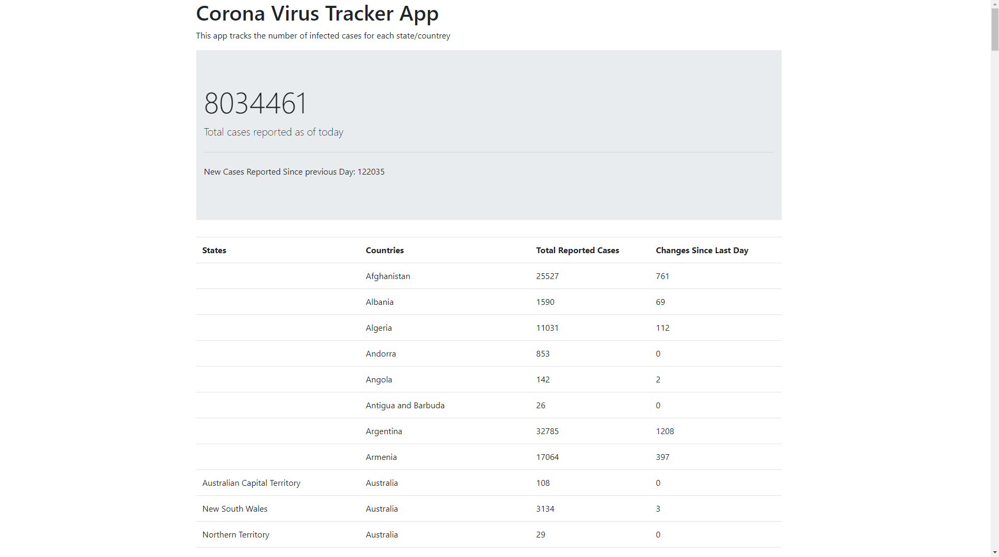

# Corona-Virus-Tracker-App

A Spring Boot Application that tracks Corona Virus Cases. 
Data gets Updated on an hourly basis.
 
 
This Project aims to introduce the following Aspects:
 
 
1- Server Side Rendering using thymeleaf
 
2- some features of Spring Boot like @Scheduled
 
3- using new Features of Java 12 HTTPClient
 
4- parsing CSV File using commons CSV Liberary
 
5- adding Bootstrap to application.properties file for some nice styling
 

